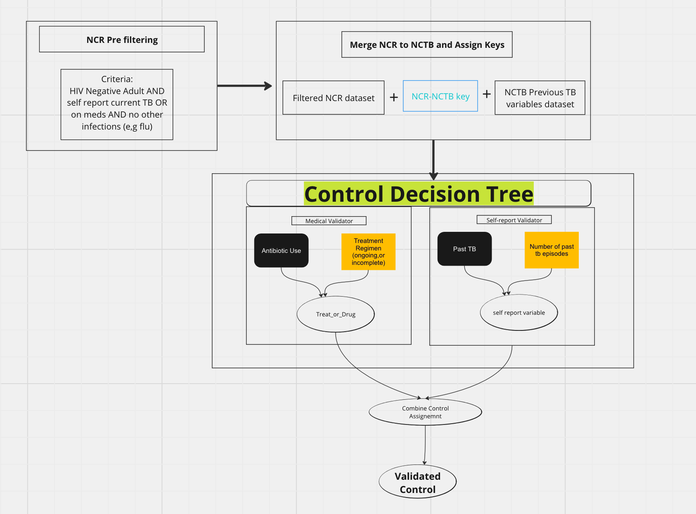

---
---
---

# TB_RNA_Seq: Merging Datasets + Assignment Trees

## There are three R scripts in this project

#### generate_key.R: It merges two Redcap Databases; the smaller RNA seq study (NCR Database) with the larger GWAS study (NCTB Database) using fuzzy name matching, saliva barcodes and manual matching. I

#### case_decision_tree.R: Assigns individuals as cases or "other" based on clinical symptoms, initial self-report and verified with current medical data

#### control_decision_tree.R :Assigns individuals as controls based on PRIOR medical records. Searches a wide range of variables for TB evidence in their lifetime.

Note that cases and control are assigned in separate scripts due to different criteria from different databases used for assignments

# Before running Scripts:

## Before running, you must

### 1) In each script manually check that the data file is the most recent from REDCAP, if not ***re-download***. The variables in the scripts where you edit these are:

#### a) control_decision_tree.R : raw_NCR_data

#### b) generate_key.R: raw_NCTB_data & raw_NCR_data

#### c) case_decision_tree.R: raw_NCR_data\_

### 2) In updated_data_merge.R you must change output_path to your actual desired path on dropbox or your desktop (it's Oshi's by default)

# Running Scripts:

### There are 2 options to run the scripts

### The scripts are run in the folllowing order

Generate key -\> control_decision_tree \| case_decision_tree

1) If you just want the NCTB-NCR key: just run generate_key.r

2) To get a list of validated case or controls run their respective decision tree. This automatically sources generate_key.r. . You should get an output pop up on your rstudio with final case/control counts and also a larger merged table with the variables used to assign cases and controls

### 3) Investigator mode: You would do this when trying to find cracks in the system like when patients violate any of the assignment criteria and why. Remember You can run case_decision_tree or control_decision_tree in any order.

After running case_decision_tree :

-   view(Validatedcases2) and check out these columns for individuals that have become "notcase_other" :

1.  lab_date_2_diag_date = lab_receive_date - TB_Diag_Date,

2.  lab_date_2_trtment_strt = lab_receive_date - treatment_srt_date,

3.  less_than_thirty = lab_receive_date - TB_Diag_Date \< 30,

4.  intermediate2 = tb_status == "Yes",

5.  intermediate3 = HIV_status == "Negative"

    if any of these columns are False or \>15 or 30 then that provides the context

#### control_decision_tree:

##### view(final_control_validated_tbl)

##### check notctrl_other and their corresponding val_sr and val_med_tb columns

if val_sr is false:

-   view(self_report_validated2) and check prior_tb_self_reported, prior_n_tb_self_reported, frst_pst_tb_test_date

if val_med_tb is false;

-   check tb_test and treat_or_drug

*#to do: make another script from updated data_merge to check for missing demographic data*
